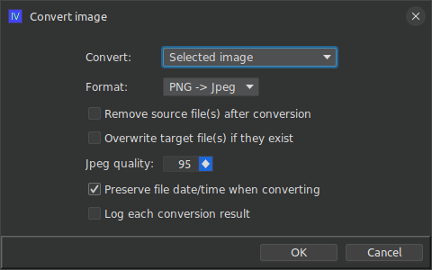

# ext-iv-image-converter

## What is this?

This is an extension for ImageViewer that allows batch conversion of images from jpeg to png format or vice versa.

### How do I use it?

Clone the repo and build the extension jar with maven:

```shell
git clone https://github.com/scorbo2/ext-iv-image-converter.git
cd ext-iv-image-converter
mvn package
```

Now you can copy the extension jar to wherever you keep your imageviewer extensions:

```shell
cp target/ext-iv-image-converter-2.2.0.jar ~/.ImageViewer/extensions
```

Now restart imageviewer and you can hit Ctrl+J or select "Convert image" from the "Edit" menu:



Here we have options to select what should be converted:

1. The currently selected image
2. All images in the current directory
3. All images in the current directory and all subdirectories

You also have options to select the format of the conversion (png -> jpeg or vice versa), as well as whether
the original images should be deleted after conversion or kept. Hit OK to begin the conversion.

### Requirements

ImageViewer 2.2 or higher

### License

Imageviewer and this extension are made available under the MIT license: https://opensource.org/license/mit
