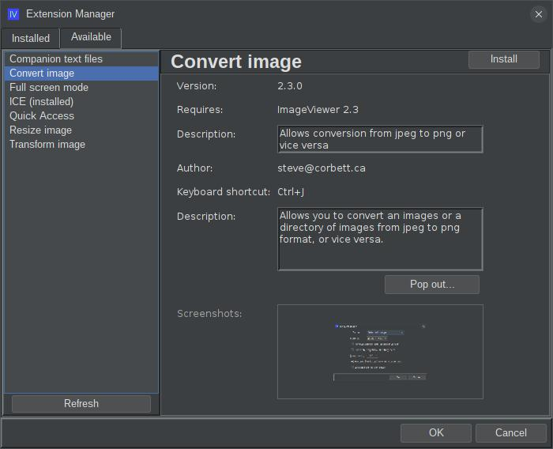

# ext-iv-image-converter

## What is this?

This is an extension for ImageViewer that allows batch conversion of images from jpeg to png format or vice versa.

## How do I get it?

### Option 1: automatic download and install

**New!** Starting in ImageViewer 2.3, you no longer need to manually build and install application extensions!
Now, you can visit the "Available" tab on the extension manager dialog:



Select "Convert image" from the list on the left, and then hit the "Install" button in the top right. If you
decide later to remove the extension, revisit the extension manager dialog, select "Convert image" from the list
on the left, and hit the "Uninstall" button in the top right. The application will prompt to restart.
It's just that easy!

### Option 2: manual download and install

You can manually download the extension jar: 
[ext-iv-image-converter-2.3.0.jar](http://www.corbett.ca/apps/ImageViewer/extensions/2.3/ext-iv-image-converter-2.3.0.jar)

Save it to your ~/.ImageViewer/extensions directory and restart the application.

### Option 3: build from source

You can clone this repo and build the extension jar with Maven (Java 17 or higher required):

```shell
git clone https://github.com/scorbo2/ext-iv-image-converter.git
cd ext-iv-image-converter
mvn package

# Copy the result to extensions directory:
cp target/ext-iv-image-converter-2.3.0.jar ~/.ImageViewer/extensions
```

## Okay, it's installed, now how do I use it?

Once ImageViewer is restarted, you can hit Ctrl+J or select "Convert image" from the "Edit" menu:


Here we have options to select what should be converted:

1. The currently selected image
2. All images in the current directory
3. All images in the current directory and all subdirectories

You also have options to select the format of the conversion (png -> jpeg or vice versa), as well as whether
the original images should be deleted after conversion or kept. Hit OK to begin the conversion.

## Requirements

ImageViewer 2.3 or higher

## License

Imageviewer and this extension are made available under the MIT license: https://opensource.org/license/mit
